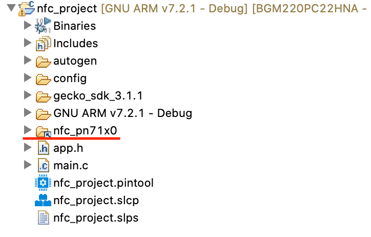

<table border="0">
  <tr>
    <td align="left" valign="middle">
    <h1>NFC Application Examples</h1>
  </td>
  <td align="left" valign="middle">
    <a href="https://www.silabs.com/products/wireless">
      
    </a>
  </td>
  </tr>
</table>

# NCI PN71x0 T2T Read

This project demonstrates how to read a T2T tag with PN71x0.

> PN71x0 stands for PN7120 and PN7150.


## Hardware Setup
You need one supported Silicon Labs board, a PN71x0 board and a T2T tag. 

### PN71x0 boards

[Mikroe NFC CLICK](https://www.mikroe.com/nfc-click) (PN7120)


[Mikroe NFC 2 CLICK](https://www.mikroe.com/nfc-2-click) (PN7150)


## Supported Silicon Labs Boards

You can use a WSTK with Jumpers and following the pinout below. You can also use Explorer Kit, such as [BGM220P Explorer Kit](https://www.silabs.com/development-tools/wireless/bluetooth/bgm220-explorer-kit) and plug in [Mikroe NFC CLICK](https://www.mikroe.com/nfc-click) or [Mikroe NFC 2 CLICK](https://www.mikroe.com/nfc-2-click) directly.


### Default Pinout

The following table covers most of the boards.

| PN71x0 Pin | WSTK EXP Pin | Note |
| :-----: | :-----: | :----- |
| GND | EXP 1 | |
| SCL | EXP 15| defined in [app.c](src/app.c) |
| SDA | EXP 16| defined in [app.c](src/app.c) |
| VEN | EXP 11| defined in [app.c](src/app.c) |
| IRQ | EXP 13| defined in [app.c](src/app.c) |
| VCC | EXP 20| |

In the case EXP 15 and EXP 16 are not connected, EXP 8 and EXP 10 are used for I2C. This applies to all xG21 devices.
If the board you are trying to use is not listed above, you can add to the top board pinout macros in [app.c](src/app.c) accordingly to add support.


## Project Hierarchy
```
 -----------------
|   Application   |----\
|-----------------|    |
|       NDEF      |    |(Init, Reset)  
|-----------------|    |       -----------------
|       TAG       |    \----> |                 |
|-----------------|           |  PN71x0 Driver  |
|       NCI       |--(TML)--> |                 |
 -----------------             -----------------
```

| Layer | Source Files | Docs |
| :----- | :----- | :----- |
| Application | [app.c](src/app.c) | - |
| Tag | [tlv.c](../../nfc_library/common/src/tlv.c) | [T2T specification](https://nfc-forum.org/product/nfc-forum-type-2-tag-specification-version-1-0/) |
| NCI | [nci.c](../../nfc_library/nci/src/nci.c), [nci_nxp_ext.c](../../nfc_library/nci/src/nci_nxp_ext.c) | [NCI specification](https://nfc-forum.org/product/nfc-controller-interface-nci-technical-specification-2-1/), [PN7120 User Manual](https://www.nxp.com/docs/en/user-guide/UM10819.pdf), [PN7150 User Manual](https://www.nxp.com/docs/en/user-guide/UM10936.pdf) |
| PN71x0 Driver | [pn71x0.c](https://github.com/SiliconLabs/platform_hardware_drivers/blob/master/nfc_pn71x0/src/pn71x0.c), [pn71x0_i2c.c](https://github.com/SiliconLabs/platform_hardware_drivers/blob/master/nfc_pn71x0/src/pn71x0_i2c.c) | [PN7120 User Manual](https://www.nxp.com/docs/en/user-guide/UM10819.pdf), [PN7150 User Manual](https://www.nxp.com/docs/en/user-guide/UM10936.pdf) |
| emlib | Silabs SDK | - |


## How it works
Launch a serial terminal and use a T2T tag to approach PN71x0 when running this example. PN71x0 should dump the memory content to the serial terminal.


## Import Instructions

0. Clone this repo.
1. Clone [platform hardware driver](https://github.com/SiliconLabs/platform_hardware_drivers) to get [nfc_pn71x0](https://github.com/SiliconLabs/platform_hardware_drivers/tree/master/nfc_pn71x0) driver.
2. Create an empty c project.
    1. Click "Create New Project" in Launcher View in Simplicity Studio 5.

        

    2. Select "Empty C Project" and click "NEXT".

        

    3. Give it a good name.

        

3. Add necessart SDK software components via SLCP.

    1. Double click the slcp file to open project configurator.

        

    2. Click on "SOFTWARE COMPONENTS".

        

    4. Search and install I2C compoent, I2C is not needed by this project, but the driver library depends on it. So install I2C component to prevent compile errors.

        

    3. Search and install IO Stream components. You can use default name "vcom" for IO Stream.

        

4. Drag in nfc_pn71x0 folder, either "Link" or "Copy" would work.

    

5. Drag in [nfc_library](../nfc_library) folder, either "Link" or "Copy" would work.

    

6. replace project app.c with [app.c](src/app.c). Make sure you have right board macro and right pinout for your board. 

    

    Board macro can be found in app.c.

    

    Board Number can be found on the back of boards like this.
    
    

7. Configure include paths.

    1. Right click on project, select properties.

        

    2. Add following include path to project.

        ```
        /${ProjName}/nfc_pn71x0/inc
        /${ProjName}/nfc_library/common/inc
        /${ProjName}/nfc_library/tag/inc
        /${ProjName}/nfc_library/nci/inc
        ```

        

  3. Should look like below when finish.

        

8. Should be able to build and run.


### Needed Include Paths

