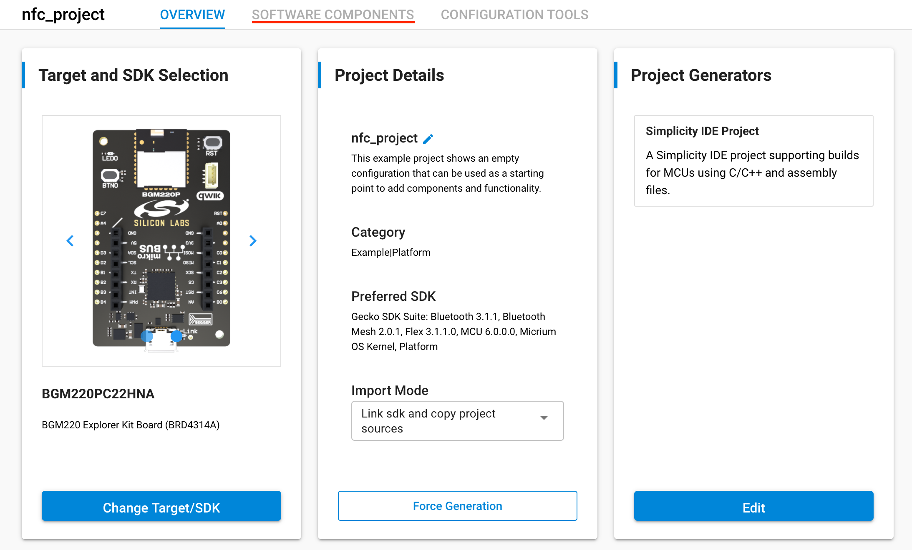
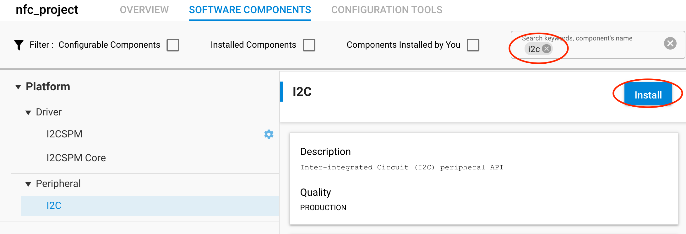
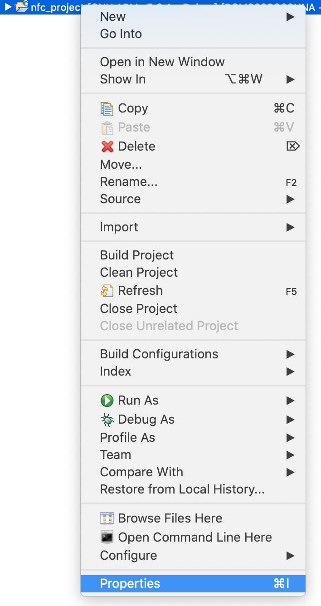

<table border="0">
  <tr>
    <td align="left" valign="middle">
    <h1>NFC Application Examples</h1>
  </td>
  <td align="left" valign="middle">
    <a href="https://www.silabs.com/products/wireless">
      
    </a>
  </td>
  </tr>
</table>

# NT3H2x11 Field Detection

This project demonstrates how field detection works with NT3H2x11. NT3H2x11 would generate a GPIO interrupt on the FD pin when a NFC field is detected. This enables functionality like NFC wakeup to allow MCU to sleep when no NFC operation is in progress.

> NT3H2x11 stands for NT3H2111 and NT3H2211.


## Gecko SDK version
v3.x


## Hardware Setup
You need one supported Silicon Labs board, a NT3H2x11 board and a NFC reader device such as a smart phone. 

### NT3H2x11 boards

[Mikroe NFC TAG 2 CLICK](https://www.mikroe.com/nfc-tag-2-click)


## Supported Silicon Labs Boards

You can use a WSTK with jumper wires and following the pinouts below. You can also use Explorer Kit, such as [BGM220P Explorer Kit](https://www.silabs.com/development-tools/wireless/bluetooth/bgm220-explorer-kit) and plug in [Mikroe NFC TAG 2 CLICK](https://www.mikroe.com/nfc-tag-2-click) directly.


### Default Pinout

| NT3H2x11 Pin | WSTK EXP Pin | Note |
| :-----: | :-----: | :----- |
| GND | EXP 1  | |
| FD  | EXP 14 | defined in [app.c](src/app.c) |
| VCC | EXP 20 | |

If the board you are trying to use is not listed above, you can add to the top board pinout macros in [app.c](src/app.c) accordingly to add support.


## Project Hierarchy
```
 -----------------
|   Application   |
|-----------------|
| NT3H2x11 Driver |
|-----------------|
|      emlib      |
 -----------------
```

| Layer | Source Files | Docs |
| :----- | :----- | :----- |
| Application | [app.c](src/app.c) | - |
| NT3H2x11 Driver | [nt3h2x11.c](https://github.com/SiliconLabs/platform_hardware_drivers/blob/master/nfc_nt3h2x11/src/nt3h2x11.c), [nt3h2x11_fd.c](https://github.com/SiliconLabs/platform_hardware_drivers/blob/master/nfc_nt3h2x11/src/nt3h2x11_fd.c) | [NT3H2111_2211.pdf](https://www.nxp.com/docs/en/data-sheet/NT3H2111_2211.pdf) |
| emlib | Silabs SDK | - |


## How it works
Simply use a NFC reader device to approach NT3H2x11 coil. When NFC reader activates NT3H2x11, it will trigger a GPIO interrupt which toggle an on-board LED.


## Import Instructions

0. Clone this repo.
1. Clone [platform hardware driver](https://github.com/SiliconLabs/platform_hardware_drivers) to get [nfc_nt3h2x11](https://github.com/SiliconLabs/platform_hardware_drivers/tree/master/nfc_nt3h2x11) driver.
2. Create an empty c project.
    1. Click "Create New Project" in Launcher View in Simplicity Studio 5.

        

    2. Select "Empty C Project" and click "NEXT".

        

    3. Give it a good name.

        

3. Add necessart SDK software components via SLCP.

    1. Double click the slcp file to open project configurator.

        

    2. Click on "SOFTWARE COMPONENTS".

        

    3. Search and install Simple LED component.

        

    4. Search and install I2C compoent, I2C is not needed by this project, but the driver library depends on it. So install I2C component to prevent compile errors.

        

4. Drag in nfc_nt3h2x11 folder, either "Link" or "Copy" would work.

    

5. replace project app.c with [app.c](src/app.c). Make sure you have right board macro and right pinout for your board. 

    

    Board macro can be found in app.c.

    

    Board Number can be found on the back of boards like this.
    
    

6. Configure include paths.

    1. Right click on project, select properties.

        

    2. Add following include path to project.

        ```
        /${ProjName}/nfc_nt3h2x11/inc
        ```

        

    3. Should look like below when finish.

        

7. Should be able to build and run.

