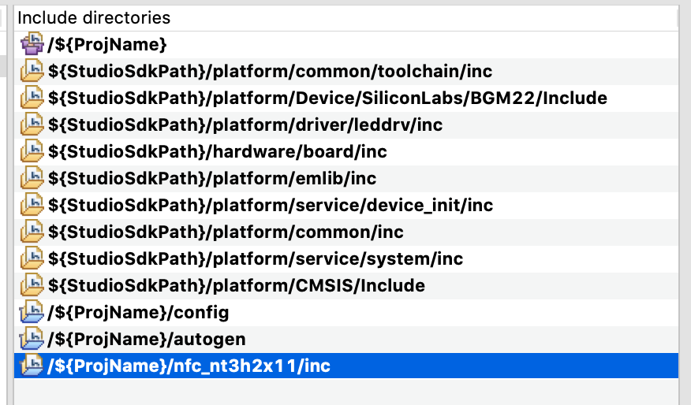

<table border="0">
  <tr>
    <td align="left" valign="middle">
    <h1>NFC Application Examples</h1>
  </td>
  <td align="left" valign="middle">
    <a href="https://www.silabs.com/products/wireless">
      
    </a>
  </td>
  </tr>
</table>

# NT3H2x11 Field Detection

This project demonstrates how field detection works with NT3H2x11. NT3H2x11 would generate a GPIO interrupt on the FD pin when a NFC field is detected. This enables functionality like NFC wakeup to allow MCU to sleep when no NFC operation is in progress.

> NT3H2x11 stands for NT3H2111 and NT3H2211.


## How it works
Simply use a NFC reader device to approach NT3H2x11 coil. When NFC reader activates NT3H2x11, it will trigger a GPIO interrupt which toggle an on-board LED.


## Hardware Setup
You need one supported Silicon Labs board, a NT3H2x11 board and a NFC reader device such as a smart phone. 

### NT3H2x11 boards

[OM23221ARD](https://www.nxp.com/products/rfid-nfc/nfc-hf/ntag/nfc-tags-for-electronics/ntag-ic-iplus-i-kit-for-arduino-pinout:OM23221ARD)


[Mikroe NFC TAG 2 CLICK](https://www.mikroe.com/nfc-tag-2-click)


## Supported Silicon Labs Boards

### xG12
BRD4103A, BRD4161A, BRD4162A, BRD4163A, BRD4164A, BRD4166A, BRD4170A, BRD4172A, BRD4172B, BRD4173A, BRD4304A

### xG13
BRD4104A, BRD4158A, BRD4159A, BRD4165B, BRD4167A BRD4168A, BRD4174A, BRD4174B, BRD4175A, BRD4305A, BRD4305C, BRD4305D, BRD4305E, BRD4306A, BRD4306B, BRD4306C, BRD4306D

### xG21
BRD4180A, BRD4180B, BRD4181A, BRD4181B, BRD4181C, BRD4308A, BRD4308B, BRD4309B

### xG22
BRD4182A, BRD4183A, BRD4184A, BRD4310A, BRD4311A


### Default Pinout

| NT3H2x11 Pin | WSTK EXP Pin | Note |
| :-----: | :-----: | :----- |
| GND | EXP 1  | |
| FD  | EXP 14 | defined in [main.c](src/main.c) |
| VCC | EXP 20 | |

If the board you are trying to use is not listed above, you can add to the top board pinout macros in [main.c](src/main.c#L50) accordingly to add support.


## Project Hierarchy
```
 -----------------
|   Application   |
|-----------------|
| NT3H2x11 Driver |
|-----------------|
|      emlib      |
 -----------------
```

| Layer | Source Files | Docs |
| :----- | :----- | :----- |
| Application | [main.c](src/main.c) | - |
| NT3H2x11 Driver | [nt3h2x11.c](https://github.com/SiliconLabs/platform_hardware_drivers/blob/master/nfc_nt3h2x11/src/nt3h2x11.c), [nt3h2x11_fd.c](https://github.com/SiliconLabs/platform_hardware_drivers/blob/master/nfc_nt3h2x11/src/nt3h2x11_fd.c) | [NT3H2111_2211.pdf](https://www.nxp.com/docs/en/data-sheet/NT3H2111_2211.pdf) |
| emlib | Silabs SDK | - |


## Generic Import Instructions

This guide is using EFR32xG22 BRD4182A as example.

1. Clone [platform hardware driver](https://github.com/SiliconLabs/platform_hardware_drivers) to somewhere. We will be needing the [nfc_nt3h2x11](https://github.com/SiliconLabs/platform_hardware_drivers/tree/master/nfc_nt3h2x11) driver.
2. Create an empty c project through MCU Project for the radio board you are using. 
    1. Click "New" button

        

    2. Select MCU Project

        

    3. Make sure have the right board and parts listed

        

    4. Select Empty C Program

        

    5. Give it a good name. If you want to verify your compiler selection, click "Next >". Otherwise, click "Finish".

        
        
3. Drag needed emlib files (shown in the diagram) from SDK into the project emlib folder.

    > File location in GSDK 2.x (Studio v4) on Mac:     
    > Simplicity Studio.app/Contents/Eclipse/developer/sdks/gecko_sdk_suite/v2.x/platform/emlib/src 

    > File location in GSDK 2.x (Studio v4) on Windows: 
    > SimplicityStudio\v4\developer\sdks\gecko_sdk_suite\v2.7\platform\emlib\src

     
    
    Use STUDIO_SDK_LOCATION if using link.

     

    Should look like below.

    

4. Drag bsp_stk_leds.c from SDK into the project.

    > File location in GSDK 2.x (Studio v4) on Mac:     
    > Simplicity Studio.app/Contents/Eclipse/developer/sdks/gecko_sdk_suite/v2.x/hardware/kit/common/bsp 

    > File location in GSDK 2.x (Studio v4) on Windows: 
    > SimplicityStudio\v4\developer\sdks\gecko_sdk_suite\v2.7\hardware\kit\common\bsp 

    

    Use STUDIO_SDK_LOCATION if using link.

     

    File is dragged into src folder in this example, feel free to put anywhere you are comfortable with.

    

5. Drag [nfc_nt3h2x11](https://github.com/SiliconLabs/platform_hardware_drivers/tree/master/nfc_nt3h2x11) driver into the project.

    

6. Replace main.c with [main.c](src/main.c) in [src](src) folder. 

    Modify [main.c](src/main.c) board macro definition to match the radio board you have. 

    

    

    This would set up the right pin definitions.

    

7. Add include paths through project properties.

    Right click to find "Properties".

    

    Add path as shown below. 

    

8. Make sure all paths are added.

    Paths needed for this project:
    
    ```
    /${ProjName}/nfc_nt3h2x11/inc
    ```

    

9. Should be able to build.


## SLS Import Instructions

V4 SLS project is based on BRD4162A radio board. 

1. Import the sls project located in [SimplicityStudio](SimplicityStudio), as described in [this guide](https://www.silabs.com/community/software/simplicity-studio/knowledge-base.entry.html/2018/09/26/exporting_importing-IEqP)

    Broken links would appear in the project.

    

2. Delete broken folder links.  

    

    Folders are copied at the creation of sls project, but since original project was using links to the folders, the imported project would have broken links. Deleting broken links would allow copied folder to show up. Just wait for a few seconds or refresh the project, the right folder should show up.

    

    

3. Replace main.c with [main.c](src/main.c) in [src](src) folder. 

4. Should be able to build.


## Disclaimer

NXP and NTAG are registered trademarks of NXP B.V.