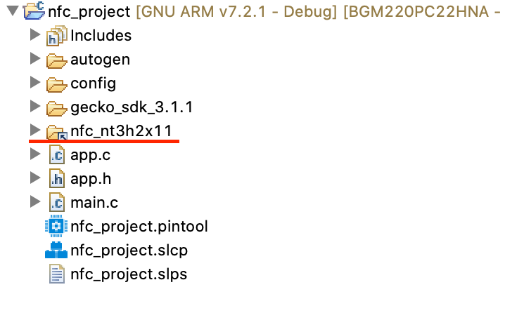

<table border="0">
  <tr>
    <td align="left" valign="middle">
    <h1>NFC Application Examples</h1>
  </td>
  <td align="left" valign="middle">
    <a href="https://www.silabs.com/products/wireless">
      
    </a>
  </td>
  </tr>
</table>

# NT3H2x11 Format T2T 
Format NT3H2x11 (NT3H2111 and NT3H2211) to make it Type 2 Tag (T2T) compatible. The factory state of NT3H2x11 is not formated to be T2T compatible, this would make smart phones not able read/write the content in NT3H2x11. This example can also used for modifying T2T_Area_Size.

> NT3H2x11 stands for NT3H2111 and NT3H2211.


## Gecko SDK version
v3.x


## Hardware Setup
You need one WSTK board, a NT3H2x11 board. 

### NT3H2x11 boards

[Mikroe NFC TAG 2 CLICK](https://www.mikroe.com/nfc-tag-2-click)


## Supported Silicon Labs Boards

You can use a WSTK with Jumpers and following the pin out below. You can also use Explorer Kit, such as [BGM220P Explorer Kit](https://www.silabs.com/development-tools/wireless/bluetooth/bgm220-explorer-kit) and plug in [Mikroe NFC TAG 2 CLICK](https://www.mikroe.com/nfc-tag-2-click) directly.


### Default Pinout

The following table covers most of the boards.

| NT3H2x11 Pin | WSTK EXP Pin | Note |
| :-----: | :-----: | :----- |
| GND | EXP 1 | |
| SCL | EXP 15| defined in [app.c](src/app.c) |
| SDA | EXP 16| defined in [app.c](src/app.c) |
| VCC | EXP 20| |

In the case EXP 15 and EXP 16 are not connected, EXP 8 and EXP 10 are used for I2C. This applies to all xG21 devices.

| NT3H2x11 Pin | WSTK EXP Pin | Note |
| :-----: | :-----: | :----- |
| GND | EXP 1 | |
| SDA | EXP 8 | defined in [app.c](src/app.c) |
| SCL | EXP 10| defined in [app.c](src/app.c) |
| VCC | EXP 20| |

As for BRD4309B and BRD4183A whose GPIO pins are quite limited, VCOM pins are utilized for I2C (VCOM will not be available).

| NT3H2x11 Pin | WSTK EXP Pin | Note |
| :-----: | :-----: | :----- |
| GND | EXP 1 | |
| SDA | EXP 12| defined in [app.c](src/app.c) |
| SCL | EXP 14| defined in [app.c](src/app.c) |
| VCC | EXP 20| |

If the board you are trying to use is not listed above, you can add to the top board pinout macros in [app.c](src/app.c) accordingly to add support.


## Project Hierarchy
```
 -------------------------
|       Application       |
|-------------------------|
|   Tag (T2T CC Format)   |
|-------------------------|
|     NT3H2x11 Driver     |
|-------------------------|
|          emlib          |
 -------------------------
```

| Layer | Source Files | Docs |
| :----- | :----- | :----- |
| Application | [app.c](src/app.c) | - |
| Tag | - | [T2T specification](https://nfc-forum.org/product/nfc-forum-type-2-tag-specification-version-1-0/) |
| NT3H2x11 Driver | [nt3h2x11.c](https://github.com/SiliconLabs/platform_hardware_drivers/blob/master/nfc_nt3h2x11/src/nt3h2x11.c), [nt3h2x11_i2c.c](https://github.com/SiliconLabs/platform_hardware_drivers/blob/master/nfc_nt3h2x11/src/nt3h2x11_i2c.c) | [NT3H2111_2211.pdf](https://www.nxp.com/docs/en/data-sheet/NT3H2111_2211.pdf) |
| emlib | Silabs SDK | - |


## How it works
WSTK writes correct Capability Container (CC) value to NT3H2x11 block 0 via I2C interface to make it T2T compatible.
 
CC are the last 4 bytes of block 0, as shown below, of any T2T compliant NFC tag IC. These bytes need to be set correctly in order for smartphone to interact with any T2T IC, such as NT3H2x11. Due to fixed 16 byte R/W size of NT3H2x11, we have to write to the entire block 0 in order to set CC.


The first byte needs to be set to 0xE1, it's a magic number that indicates it's is a T2T.

The second byte is set to 0x10, it indicates T2T mapping version 1.0.

The third byte sets T2T_Area Size, T2T_Area Size = T2T_CC2_SIZE * 8. 

The fourth byte is access condition, which is not set here. 

Run this project with a serial terminal, follow the prompt to set your desired T2T_CC2_SIZE.


Use another NFC reader, such as android phone or [nr3h2x11_i2c_read_tag](../nr3h2x11_i2c_read_tag) to check your write result.


## Warning 
> As I2C address (byte 0) and static lock bytes (byte 10 and byte 11) are coded in block 00h from I2C side, the I2C address may be changed or the tag may be locked unintentionally, when changing CC. -- NT3H2111_2211 Datasheet

Modifying I2C address unintentionaly could prevent further communication via I2C. Modifying lock bits could permanently disable write access to some memory regions. Modify those bits carefully, only if you need it.


## Import Instructions

0. Clone this repo.
1. Clone [platform hardware driver](https://github.com/SiliconLabs/platform_hardware_drivers) to get [nfc_nt3h2x11](https://github.com/SiliconLabs/platform_hardware_drivers/tree/master/nfc_nt3h2x11) driver.
2. Create an empty c project.
    1. Click "Create New Project" in Launcher View in Simplicity Studio 5.

        

    2. Select "Empty C Project" and click "NEXT".

        

    3. Give it a good name.

        

3. Add necessart SDK software components via SLCP.

    1. Double click the slcp file to open project configurator.

        

    2. Click on "SOFTWARE COMPONENTS".

        

    4. Search and install I2C compoent, I2C is not needed by this project, but the driver library depends on it. So install I2C component to prevent compile errors.

        

    3. Search and install IO Stream components. You can use default name "vcom" for IO Stream.

        

4. Drag in nfc_nt3h2x11 folder, either "Link" or "Copy" would work.

    

5. Drag in [nfc_library](../nfc_library) folder, either "Link" or "Copy" would work.

    

6. replace project app.c with [app.c](src/app.c). Make sure you have right board macro and right pinout for your board. 

    

    Board macro can be found in app.c.

    

    Board Number can be found on the back of boards like this.
    
    

7. Configure include paths.

    1. Right click on project, select properties.

        

    2. Add following include path to project.

        ```
        /${ProjName}/nfc_nt3h2x11/inc
        /${ProjName}/nfc_library/tag/inc
        ```

        

  3. Should look like below when finish.

        

8. Should be able to build and run.
