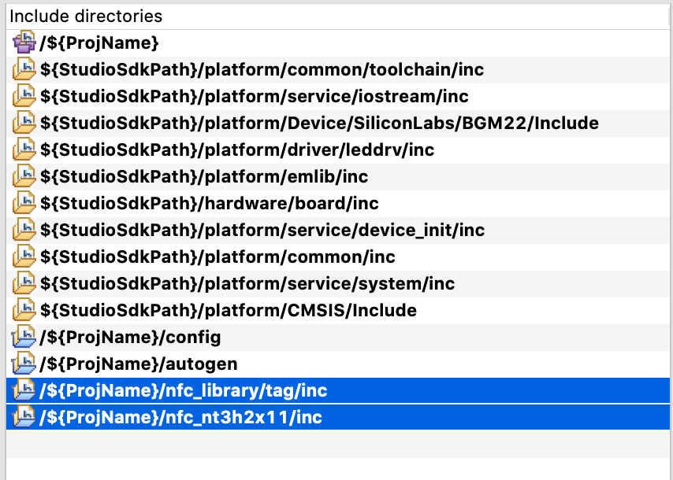

<table border="0">
  <tr>
    <td align="left" valign="middle">
    <h1>NFC Application Examples</h1>
  </td>
  <td align="left" valign="middle">
    <a href="https://www.silabs.com/products/wireless">
      
    </a>
  </td>
  </tr>
</table>

# NT3H2x11 Format T2T 
Format NT3H2x11 (NT3H2111 and NT3H2211) to make it Type 2 Tag (T2T) compatible. The factory state of NT3H2x11 is not formated to be T2T compatible, this would make smart phones not able read/write the content in NT3H2x11. This example can also used for modifying T2T_Area_Size.

> NT3H2x11 stands for NT3H2111 and NT3H2211.


## How it works
WSTK writes correct Capability Container (CC) value to NT3H2x11 block 0 via I2C interface to make it T2T compatible.

CC are the last 4 bytes of block 0, as shown below, of any T2T compliant NFC tag IC. these bytes need to be set correctly in order for smartphone to interact with any T2T IC, such as NT3H2x11. Due to fixed 16 byte R/W size of NT3H2x11, we have to write to the entire block 0 in order to set CC.


The first byte needs to be set to 0xE1, it's a magic number that indicates it's is a T2T.

The second byte is set to 0x10, it indicates T2T mapping version 1.0.

The third byte sets T2T_Area Size, T2T_Area Size = T2T_AREA_SIZE * 8. Can be modified accordingly by changing the T2T_AREA_SIZE macro.

The fourth byte is access condition, which is not set here. 

This example set CC to {0xE1, 0x10, 0x6D, 0x00} by default.


## Warning 
> As I2C address (byte 0) and static lock bytes (byte 10 and byte 11) are coded in block 00h from I2C side, the I2C address may be changed or the tag may be locked unintentionally, when changing CC. -- NT3H2111_2211 Datasheet

Modifying I2C address unintentionaly could prevent further communication via I2C. Modifying lock bits could permanently disable write access to some memory regions. Modify those bits carefully, only if you need it.


## Hardware Setup
You need one WSTK board, a NT3H2x11 board. 

### NT3H2x11 boards

[OM23221ARD](https://www.nxp.com/products/rfid-nfc/nfc-hf/ntag/nfc-tags-for-electronics/ntag-ic-iplus-i-kit-for-arduino-pinout:OM23221ARD)


[Mikroe NFC TAG 2 CLICK](https://www.mikroe.com/nfc-tag-2-click)


## Supported Silicon Labs Boards

### xG12
BRD4103A, BRD4161A, BRD4162A, BRD4163A, BRD4164A, BRD4166A, BRD4170A, BRD4172A, BRD4172B, BRD4173A, BRD4304A

### xG13
BRD4104A, BRD4158A, BRD4159A, BRD4165B, BRD4167A BRD4168A, BRD4174A, BRD4174B, BRD4175A, BRD4305A, BRD4305C, BRD4305D, BRD4305E, BRD4306A, BRD4306B, BRD4306C, BRD4306D

### xG21
BRD4180A, BRD4180B, BRD4181A, BRD4181B, BRD4181C, BRD4308A, BRD4308B, BRD4309B

### xG22
BRD4182A, BRD4183A, BRD4184A, BRD4310A, BRD4311A


### Default Pinout

The following table covers most of the boards.

| NT3H2x11 Pin | WSTK EXP Pin | Note |
| :-----: | :-----: | :----- |
| GND | EXP 1 | |
| SCL | EXP 15| defined in [main.c](src/main.c) |
| SDA | EXP 16| defined in [main.c](src/main.c) |
| VCC | EXP 20| |

In the case EXP 15 and EXP 16 are not connected, EXP 8 and EXP 10 are used for I2C. This applies to all xG21 devices.

| NT3H2x11 Pin | WSTK EXP Pin | Note |
| :-----: | :-----: | :----- |
| GND | EXP 1 | |
| SDA | EXP 8 | defined in [main.c](src/main.c) |
| SCL | EXP 10| defined in [main.c](src/main.c) |
| VCC | EXP 20| |

As for BRD4309B and BRD4183A whose GPIO pins are quite limited, VCOM pins are utilized for I2C (VCOM will not be available).

| NT3H2x11 Pin | WSTK EXP Pin | Note |
| :-----: | :-----: | :----- |
| GND | EXP 1 | |
| SDA | EXP 12| defined in [main.c](src/main.c) |
| SCL | EXP 14| defined in [main.c](src/main.c) |
| VCC | EXP 20| |

If the board you are trying to use is not listed above, you can add to the top board pinout macros in [main.c](src/main.c#L50) accordingly to add support.


## Project Hierarchy
```
 -------------------------
|       Application       |
|-------------------------|
|   Tag (T2T CC Format)   |
|-------------------------|
|     NT3H2x11 Driver     |
|-------------------------|
|          emlib          |
 -------------------------
```

| Layer | Source Files | Docs |
| :----- | :----- | :----- |
| Application | [main.c](src/main.c) | - |
| Tag | - | [T2T specification](https://nfc-forum.org/product/nfc-forum-type-2-tag-specification-version-1-0/) |
| NT3H2x11 Driver | [nt3h2x11.c](https://github.com/SiliconLabs/platform_hardware_drivers/blob/master/nfc_nt3h2x11/src/nt3h2x11.c), [nt3h2x11_i2c.c](https://github.com/SiliconLabs/platform_hardware_drivers/blob/master/nfc_nt3h2x11/src/nt3h2x11_i2c.c) | [NT3H2111_2211.pdf](https://www.nxp.com/docs/en/data-sheet/NT3H2111_2211.pdf) |
| emlib | Silabs SDK | - |


## Generic Import Instructions

This guide is using EFR32xG22 BRD4182A as example.

1. Clone [platform hardware driver](https://github.com/SiliconLabs/platform_hardware_drivers) to somewhere. We will be needing the [nfc_nt3h2x11](https://github.com/SiliconLabs/platform_hardware_drivers/tree/master/nfc_nt3h2x11) driver.
2. Create an empty c project through MCU Project for the radio board you are using. 
    1. Click "New" button

        

    2. Select MCU Project

        

    3. Make sure have the right board and parts listed

        

    4. Select Empty C Program

        

    5. Give it a good name. If you want to verify your compiler selection, click "Next >". Otherwise, click "Finish".

        
        
3. Drag needed emlib files (shown in the diagram) from SDK into the project emlib folder.

    > File location in GSDK 2.x (Studio v4) on Mac: \
    > Simplicity Studio.app/Contents/Eclipse/developer/sdks/gecko_sdk_suite/v2.x/platform/emlib/src 

    > File location in GSDK 2.x (Studio v4) on Windows: \
    > SimplicityStudio\v4\developer\sdks\gecko_sdk_suite\v2.7\platform\emlib\src

     

    Use STUDIO_SDK_LOCATION if using link.

     

    Should look like below.

    

4. Drag retargetserial.c and retargetio.c from SDK into the project.

    > File location in GSDK 2.x (Studio v4) on Mac: \
    > Simplicity Studio.app/Contents/Eclipse/developer/sdks/gecko_sdk_suite/v2.x/hardware/kit/common/drivers 

    > File location in GSDK 2.x (Studio v4) on Windows: \
    > SimplicityStudio\v4\developer\sdks\gecko_sdk_suite\v2.7\hardware\kit\common\drivers 

    
    
    Use STUDIO_SDK_LOCATION if using link.

     

    Files are dragged into src folder in this example, feel free to put anywhere you are comfortable with.

    

5. Drag [nfc_nt3h2x11](https://github.com/SiliconLabs/platform_hardware_drivers/tree/master/nfc_nt3h2x11) driver into the project.

    

6. Drag [nfc_library](../../nfc_library) into the project.

    

7. Replace main.c with [main.c](src/main.c) in [src](src) folder. 

    Modify [main.c](src/main.c) board macro definition to match the radio board you have. 

    

    

    This would set up the right pin definitions.

    

8. Add include paths through project properties.

    Right click to find "Properties".

    

    Add path as shown below. 

    

9. Make sure all paths are added.

    Paths needed for this project:
    
    ```
    /${ProjName}/nfc_nt3h2x11/inc
    /${ProjName}/nfc_library/tag/inc
    ```

    

10. Should be able to build.


## SLS Import Instructions

V4 SLS project is based on BRD4162A radio board. 

1. Import the sls project located in [SimplicityStudio](SimplicityStudio), as described in [this guide](https://www.silabs.com/community/software/simplicity-studio/knowledge-base.entry.html/2018/09/26/exporting_importing-IEqP)

    Broken links would appear in the project.

    

2. Delete broken folder links.  

    

    Folders are copied at the creation of sls project, but since original project was using links to the folders, the imported project would have broken links. Deleting broken links would allow copied folder to show up. Just wait for a few seconds or refresh the project, the right folder should show up.

    

    

3. Replace main.c with [main.c](src/main.c) in [src](src) folder. 

4. Should be able to build.


## Disclaimer

NXP and NTAG are registered trademarks of NXP B.V.