<table border="0">
  <tr>
    <td align="left" valign="middle">
    <h1>NFC Application Examples</h1>
  </td>
  <td align="left" valign="middle">
    <a href="https://www.silabs.com/products/wireless">
      
    </a>
  </td>
  </tr>
</table>

# NT3H2x11 I2C Read Tag 
This project demostrates how to read data from NT3H2x11 memory through I2C interface.

## How it works 
The WSTK will read NT3H2x11 content through I2C interface. Content is then dumped through serial interface as shown below.

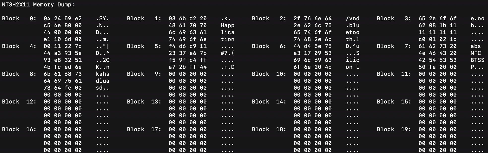

If VCOM will not be available when choosing to use I2C for this device (BRD4309B and BRD4183A), you will need some other ways to view the data.


## Hardware Setup
You need one supported Silicon Labs board, a NT3H2x11 board.  

### NT3H2x11 boards

[OM23221ARD](https://www.nxp.com/products/rfid-nfc/nfc-hf/ntag/nfc-tags-for-electronics/ntag-ic-iplus-i-kit-for-arduino-pinout:OM23221ARD)

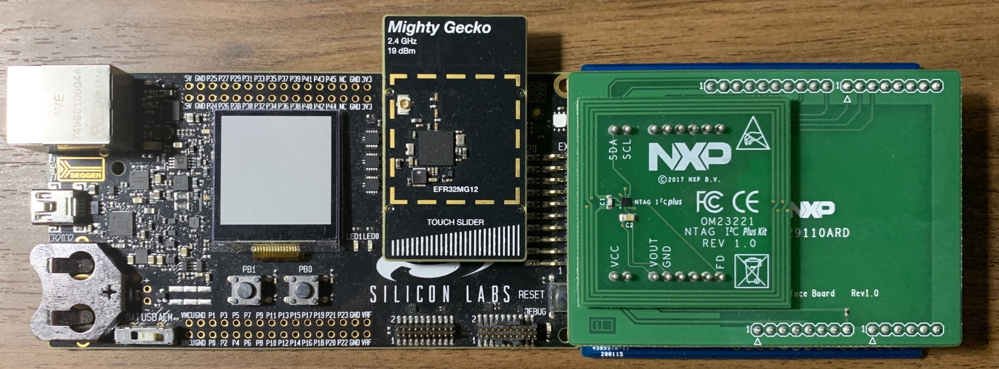

[Mikroe NFC TAG 2 CLICK](https://www.mikroe.com/nfc-tag-2-click)


## Supported Silicon Labs Boards

### xG12
BRD4103A, BRD4161A, BRD4162A, BRD4163A, BRD4164A, BRD4166A, BRD4170A, BRD4172A, BRD4172B, BRD4173A, BRD4304A

### xG13
BRD4104A, BRD4158A, BRD4159A, BRD4165B, BRD4167A BRD4168A, BRD4174A, BRD4174B, BRD4175A, BRD4305A, BRD4305C, BRD4305D, BRD4305E, BRD4306A, BRD4306B, BRD4306C, BRD4306D

### xG21
BRD4180A, BRD4180B, BRD4181A, BRD4181B, BRD4181C, BRD4308A, BRD4308B, BRD4309B

### xG22
BRD4182A, BRD4183A, BRD4184A, BRD4310A, BRD4311A


### Default Pinout

The following table covers most of the boards.

| NT3H2x11 Pin | WSTK EXP Pin | Note |
| :-----: | :-----: | :----- |
| GND | EXP 1 | |
| SCL | EXP 15| defined in [main.c](src/main.c) |
| SDA | EXP 16| defined in [main.c](src/main.c) |
| VCC | EXP 20| |

In the case EXP 15 and EXP 16 are not connected, EXP 8 and EXP 10 are used for I2C. This applies to all xG21 devices.

| NT3H2x11 Pin | WSTK EXP Pin | Note |
| :-----: | :-----: | :----- |
| GND | EXP 1 | |
| SDA | EXP 8 | defined in [main.c](src/main.c) |
| SCL | EXP 10| defined in [main.c](src/main.c) |
| VCC | EXP 20| |

As for BRD4309B and BRD4183A whose GPIO pins are quite limited, VCOM pins are utilized for I2C (VCOM will not be available).

| NT3H2x11 Pin | WSTK EXP Pin | Note |
| :-----: | :-----: | :----- |
| GND | EXP 1 | |
| SDA | EXP 12| defined in [main.c](src/main.c) |
| SCL | EXP 14| defined in [main.c](src/main.c) |
| VCC | EXP 20| |

If the board you are trying to use is not listed above, you can add to the top board pinout macros in [main.c](src/main.c#L50) accordingly to add support.


## Project Hierarchy
```
 -----------------
|   Application   |
|-----------------|
| NT3H2x11 Driver |
|-----------------|
|      emlib      |
 -----------------
```

| Layer | Source Files | Docs |
| :----- | :----- | :----- |
| Application | [main.c](src/main.c) | - |
| NT3H2x11 Driver | [nt3h2x11.c](https://github.com/SiliconLabs/nfc_library/blob/master/nt3h2x11/src/nt3h2x11.c), [nt3h2x11_i2c.c](https://github.com/SiliconLabs/nfc_library/blob/master/nt3h2x11/src/nt3h2x11_i2c.c) | [NT3H2111_2211.pdf](https://www.nxp.com/docs/en/data-sheet/NT3H2111_2211.pdf) |
| emlib | Silabs SDK | - |


## Generic Import Instructions

This guide is using EFR32xG22 BRD4182A as example.

1. Clone [platform hardware driver](https://github.com/SiliconLabs/platform_hardware_drivers) to somewhere. We will be needing the [nfc_nt3h2x11]() driver.
2. Create an empty c project through MCU Project for the radio board you are using. 
    1. Click "New" button

        

    2. Select MCU Project

        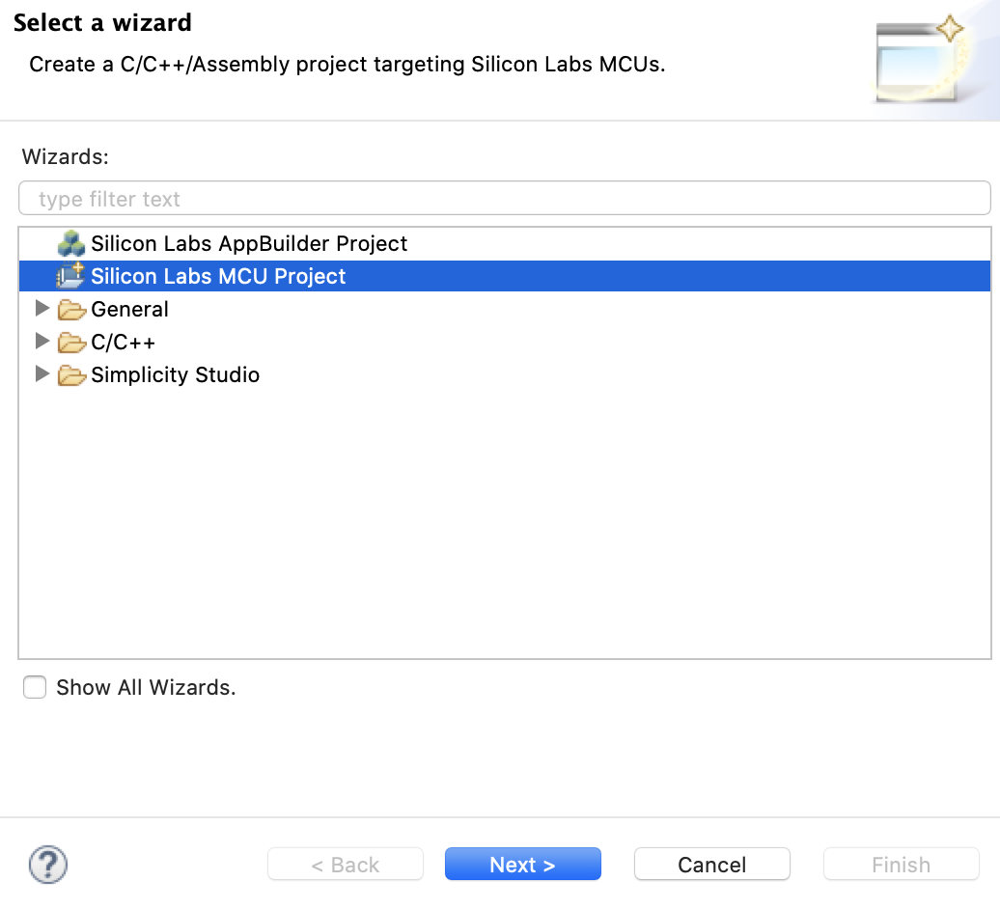

    3. Make sure have the right board and parts listed

        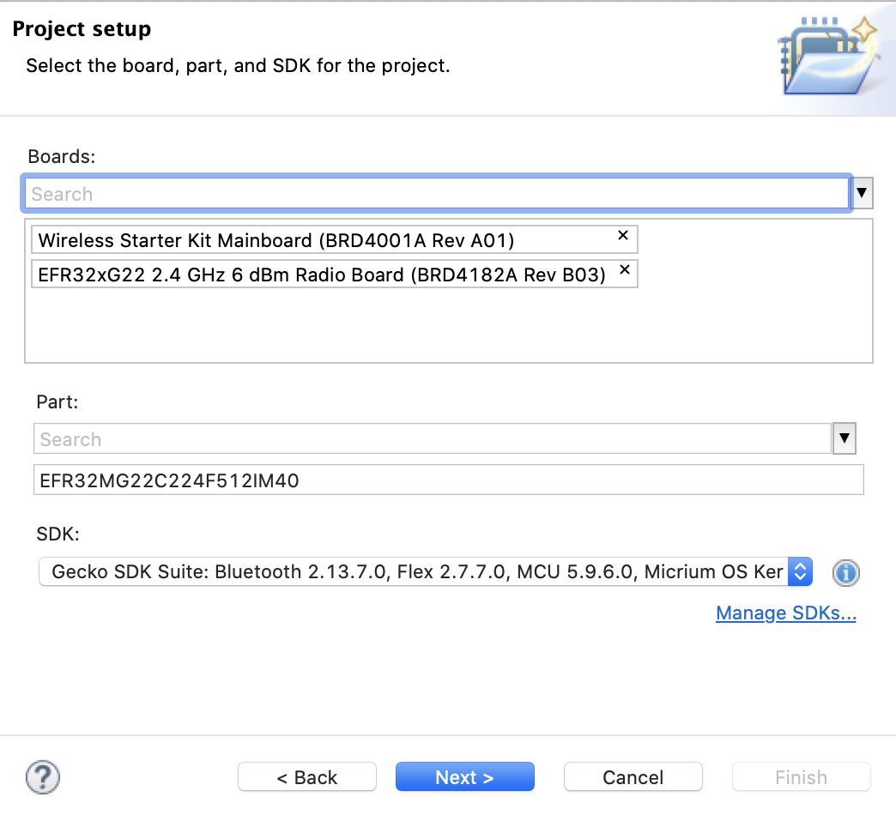

    4. Select Empty C Program

        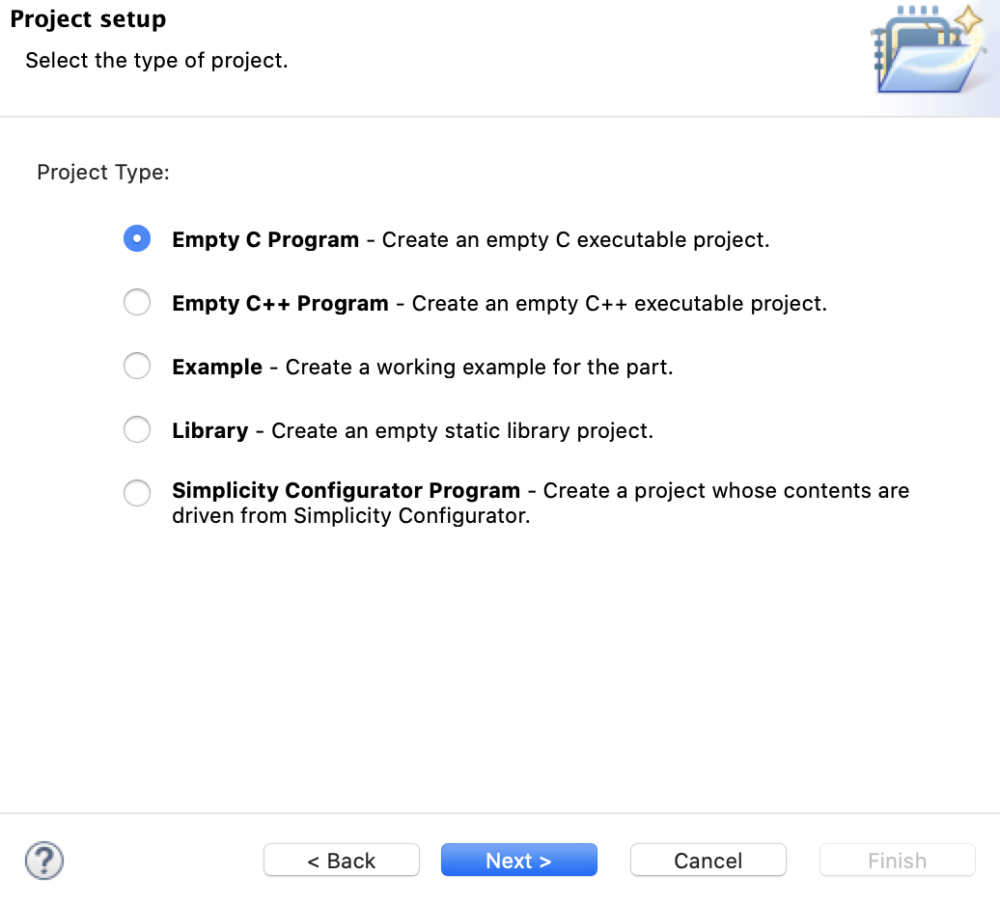

    5. Give it a good name. If you want to verify your compiler selection, click "Next >". Otherwise, click "Finish".

        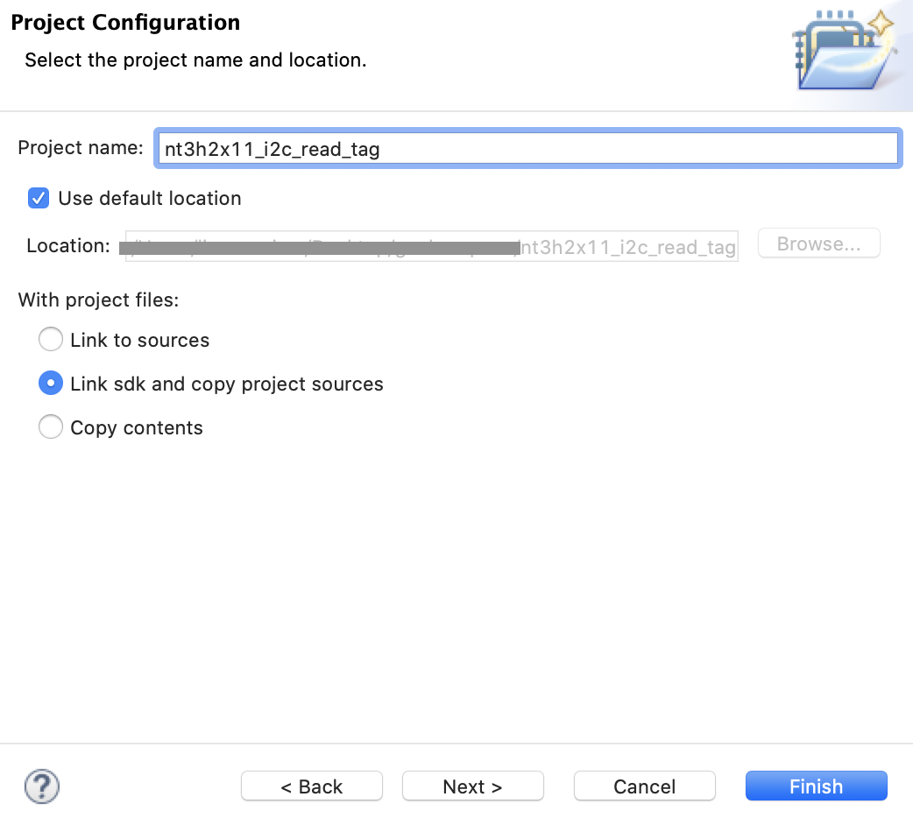
        
3. Drag needed emlib files (shown in the diagram) from SDK into the project emlib folder.

    > File location in GSDK 2.x (Studio v4) on Mac: \
    > Simplicity Studio.app/Contents/Eclipse/developer/sdks/gecko_sdk_suite/v2.x/platform/emlib/src 

    > File location in GSDK 2.x (Studio v4) on Windows: \
    > SimplicityStudio\v4\developer\sdks\gecko_sdk_suite\v2.7\platform\emlib\src

    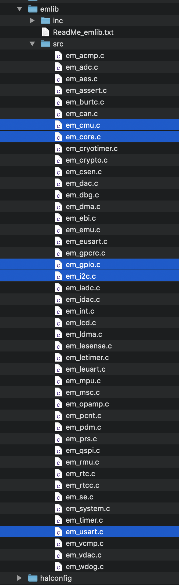 

    Use STUDIO_SDK_LOCATION if using link.

     

    Should look like below.

    

4. Drag retargetserial.c and retargetio.c from SDK into the project.

    > File location in GSDK 2.x (Studio v4) on Mac: \
    > Simplicity Studio.app/Contents/Eclipse/developer/sdks/gecko_sdk_suite/v2.x/hardware/kit/common/drivers 

    > File location in GSDK 2.x (Studio v4) on Windows: \
    > SimplicityStudio\v4\developer\sdks\gecko_sdk_suite\v2.7\hardware\kit\common\drivers 

    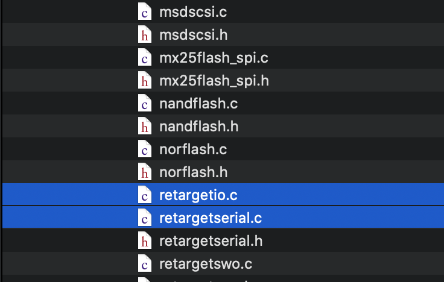
    
    Use STUDIO_SDK_LOCATION if using link.

     

    Files are dragged into src folder in this example, feel free to put anywhere you are comfortable with.

    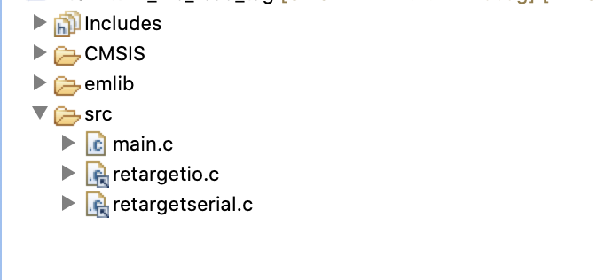

5. Drag [nfc_nt3h2x11]() driver into the project.

    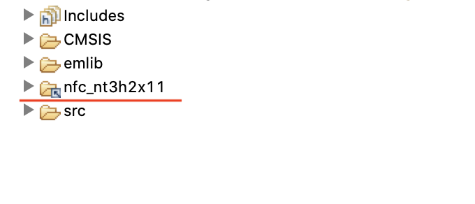

6. Drag [nfc_library](../../nfc_library) into the project.

    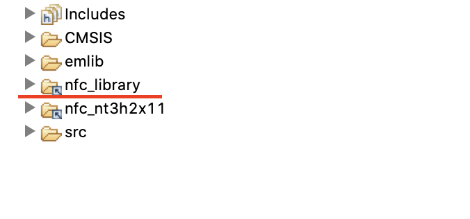

7. Replace main.c with [main.c](src/main.c) in [src](src) folder. 

    Modify [main.c](src/main.c) board macro definition to match the radio board you have. 

    

    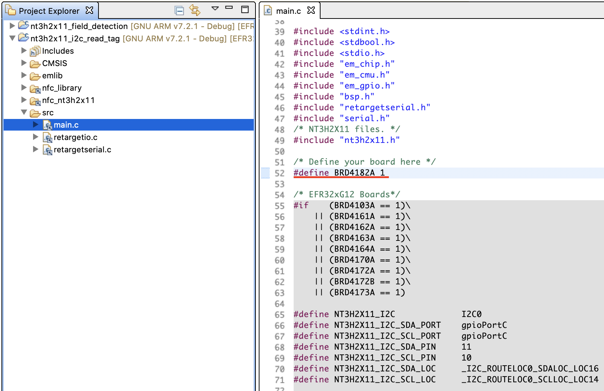

    This would set up the right pin definitions.

    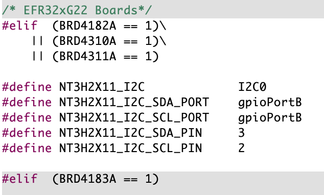

8. Add include paths through project properties.

    Right click to find "Properties".

    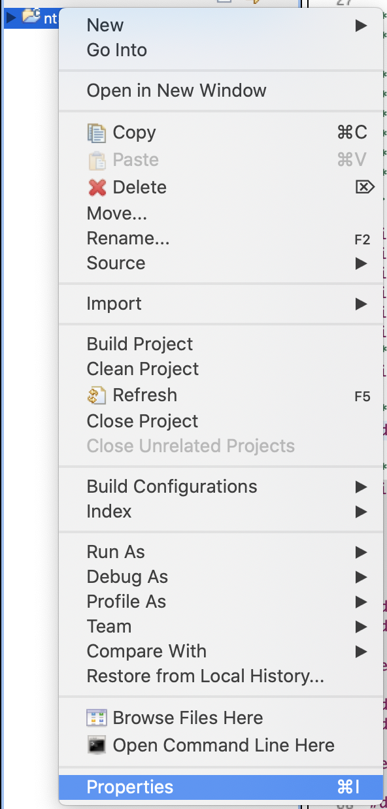

    Add path as shown below. 

    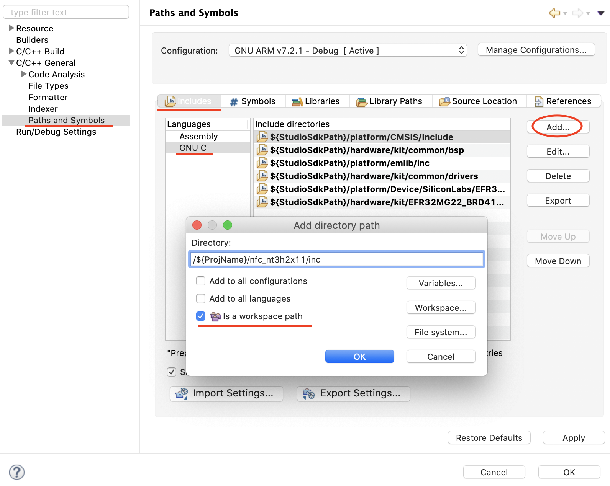

9. Make sure all paths are added.

    Paths needed for this project:
    
    ```
    /${ProjName}/nfc_nt3h2x11/inc
    /${ProjName}/nfc_library/common/inc
    ```

    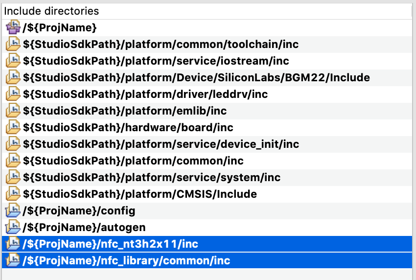

10. Should be able to build.


## Disclaimer

NXP and NTAG are registered trademarks of NXP B.V.