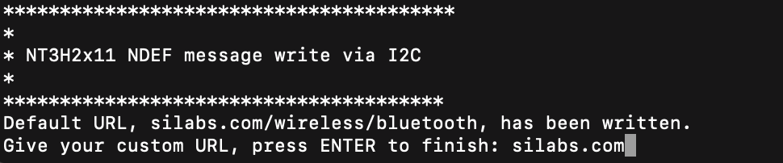
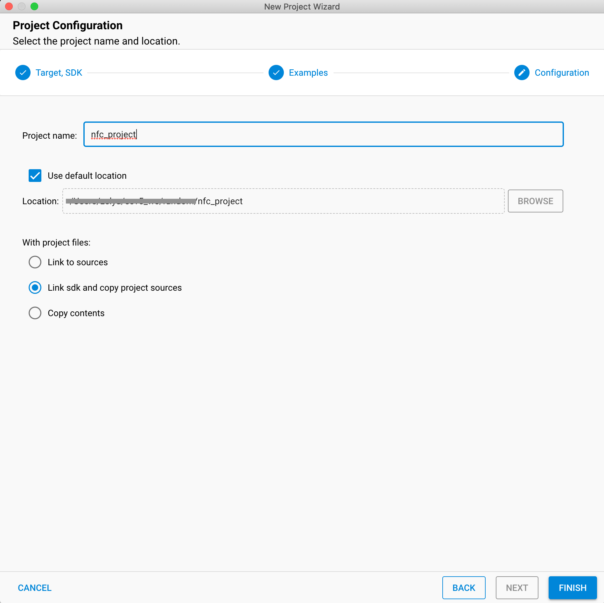
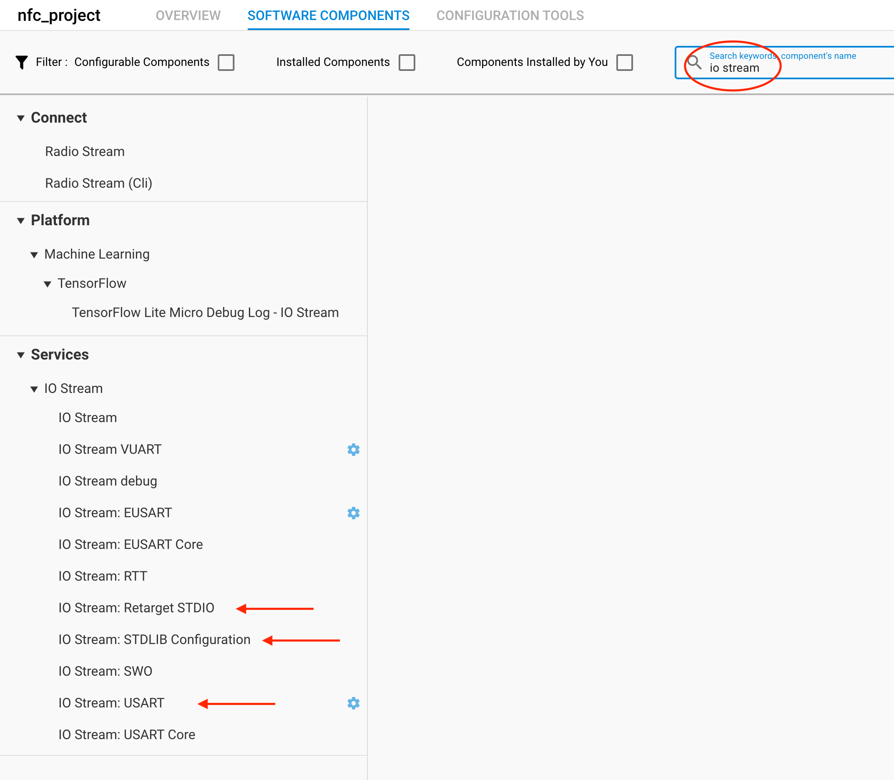
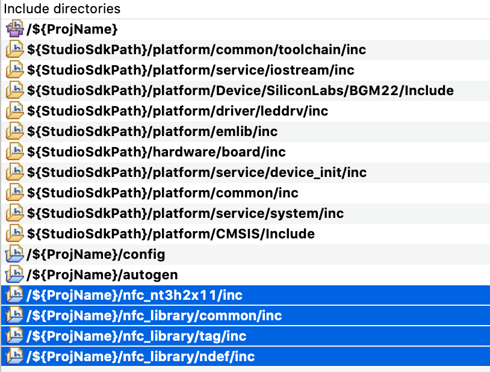

<table border="0">
  <tr>
    <td align="left" valign="middle">
    <h1>NFC Application Examples</h1>
  </td>
  <td align="left" valign="middle">
    <a href="https://www.silabs.com/products/wireless">
      
    </a>
  </td>
  </tr>
</table>

# NT3H2x11 I2C Write Tag NDEF
Write an NDEF message into NT3H2x11 EEPROM through I2C interface.

> NT3H2x11 stands for NT3H2111 and NT3H2211.


## Gecko SDK version
v3.x


## Hardware Setup
You need one supported Silicon Labs board, a NT3H2x11 board and a NFC reader device such as a smart phone. 

### NT3H2x11 boards

[Mikroe NFC TAG 2 CLICK](https://www.mikroe.com/nfc-tag-2-click)


### NFC Reader
- Smart phone NFC app: Download a NFC app on iPhone or Android and use it to read the tag.
- Newer Phone with more recent OS: OS itself would poll for NFC tag, such as iOS 12+
- Embedded NFC reader: More control, but content may have to be parsed by yourslef.

## Supported Silicon Labs Boards

You can use a WSTK with Jumpers and following the pin out below. You can also use Explorer Kit, such as [BGM220P Explorer Kit](https://www.silabs.com/development-tools/wireless/bluetooth/bgm220-explorer-kit) and plug in [Mikroe NFC TAG 2 CLICK](https://www.mikroe.com/nfc-tag-2-click) directly.


### Default Pinout

The following table covers most of the boards.

| NT3H2x11 Pin | WSTK EXP Pin | Note |
| :-----: | :-----: | :----- |
| GND | EXP 1 | |
| SCL | EXP 15| defined in [main.c](src/main.c) |
| SDA | EXP 16| defined in [main.c](src/main.c) |
| VCC | EXP 20| |

In the case EXP 15 and EXP 16 are not connected, EXP 8 and EXP 10 are used for I2C. This applies to all xG21 radio boards.

| NT3H2x11 Pin | WSTK EXP Pin | Note |
| :-----: | :-----: | :----- |
| GND | EXP 1 | |
| SDA | EXP 8 | defined in [main.c](src/main.c) |
| SCL | EXP 10| defined in [main.c](src/main.c) |
| VCC | EXP 20| |

As for BRD4309B and BRD4183A whose GPIO pins are quite limited, VCOM pins are utilized for I2C (VCOM will not be available).

| NT3H2x11 Pin | WSTK EXP Pin | Note |
| :-----: | :-----: | :----- |
| GND | EXP 1 | |
| SDA | EXP 12| defined in [main.c](src/main.c) |
| SCL | EXP 14| defined in [main.c](src/main.c) |
| VCC | EXP 20| |

If the board you are trying to use is not listed above, you can add to the top board pinout macros in [main.c](src/main.c#L50) accordingly to add support.


## Project Hierarchy
```
 -------------------------
|       Application       |
|-------------------------|
|           NDEF          |
|-------------------------|
| Tag (T2T TLV Container) |
|-------------------------|
|     NT3H2x11 Driver     |
|-------------------------|
|          emlib          |
 -------------------------
```

| Layer | Source Files | Docs |
| :----- | :----- | :----- |
| Application | [main.c](src/main.c) | - |
| NDEF | [ndef_record.c](../../nfc_library/ndef/src/ndef_record.c), [ndef_message.c](../../nfc_library/ndef/src/ndef_message.c) | [NDEF specification](https://nfc-forum.org/product/nfc-data-exchange-format-ndef-technical-specification/) |
| Tag | [tlv.c](../../nfc_library/common/src/tlv.c) | [T2T specification](https://nfc-forum.org/product/nfc-forum-type-2-tag-specification-version-1-0/) |
| NT3H2x11 Driver | [nt3h2x11.c](https://github.com/SiliconLabs/platform_hardware_drivers/blob/master/nfc_nt3h2x11/src/nt3h2x11.c), [nt3h2x11_i2c.c](https://github.com/SiliconLabs/platform_hardware_drivers/blob/master/nfc_nt3h2x11/src/nt3h2x11_i2c.c) | [NT3H2111_2211.pdf](https://www.nxp.com/docs/en/data-sheet/NT3H2111_2211.pdf) |
| emlib | Silabs SDK | - |


## How it works
WSTK writes an NDEF message to NT3H2x11 via I2C interface. Then use a NFC reader to read the updated content in NT3H2x11. 

This example will write a NDEF record with default URL like shown below.


Then you can change it to other URLs by inputing it into the serial terminal.




## Import Instructions

0. Clone this repo.
1. Clone [platform hardware driver](https://github.com/SiliconLabs/platform_hardware_drivers) to get [nfc_nt3h2x11](https://github.com/SiliconLabs/platform_hardware_drivers/tree/master/nfc_nt3h2x11) driver.
2. Create an empty c project.
    1. Click "Create New Project" in Launcher View in Simplicity Studio 5.

        

    2. Select "Empty C Project" and click "NEXT".

        

    3. Give it a good name.

        

3. Add necessart SDK software components via SLCP.

    1. Double click the slcp file to open project configurator.

        

    2. Click on "SOFTWARE COMPONENTS".

        

    4. Search and install I2C compoent, I2C is not needed by this project, but the driver library depends on it. So install I2C component to prevent compile errors.

        

    3. Search and install IO Stream components. You can use default name "vcom" for IO Stream.

        

4. Drag in nfc_nt3h2x11 folder, either "Link" or "Copy" would work.

    

5. Drag in [nfc_library](../nfc_library) folder, either "Link" or "Copy" would work.

    

6. replace project app.c with [app.c](src/app.c). Make sure you have right board macro and right pinout for your board. 

    

    Board macro can be found in app.c.

    

    Board Number can be found on the back of boards like this.
    
    

7. Configure include paths.

    1. Right click on project, select properties.

        

    2. Add following include path to project.

        ```
        /${ProjName}/nfc_nt3h2x11/inc
        /${ProjName}/nfc_library/common/inc
        /${ProjName}/nfc_library/tag/inc
        /${ProjName}/nfc_library/ndef/inc
        ```

        

  3. Should look like below when finish.

        

8. Should be able to build and run.

